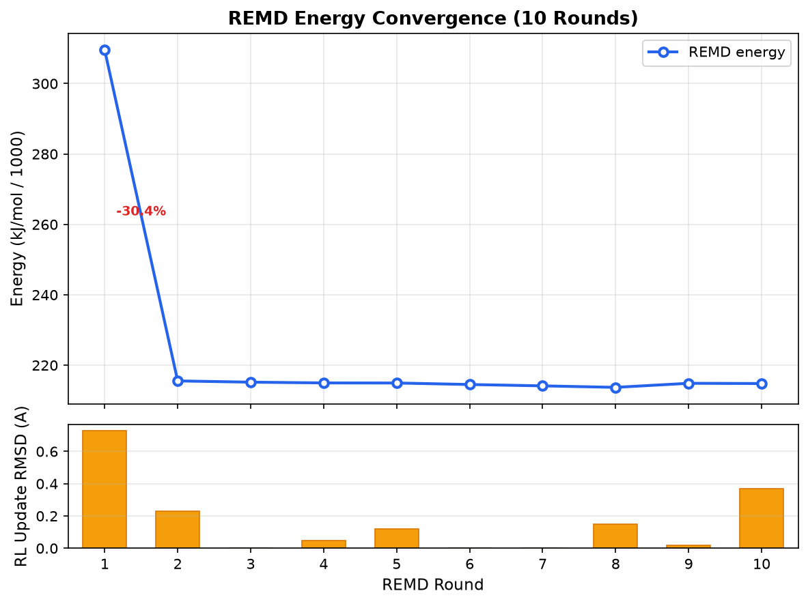
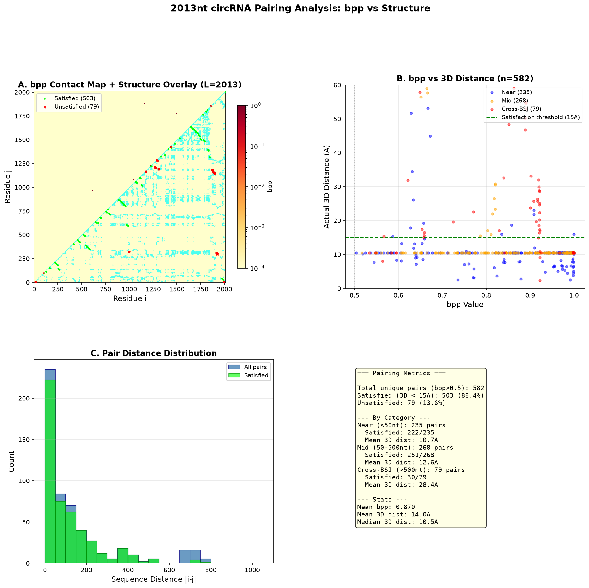
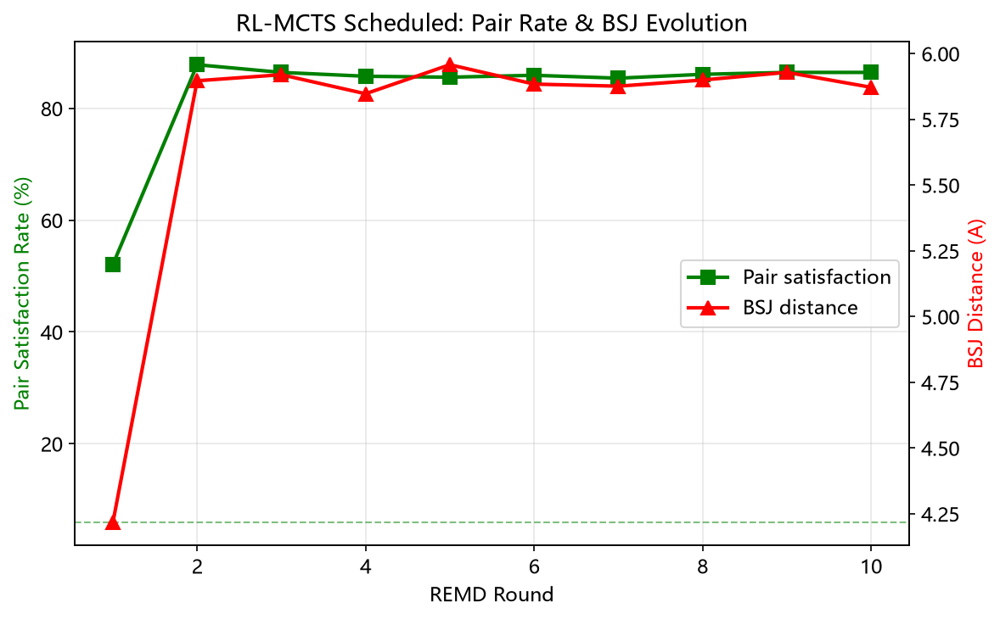
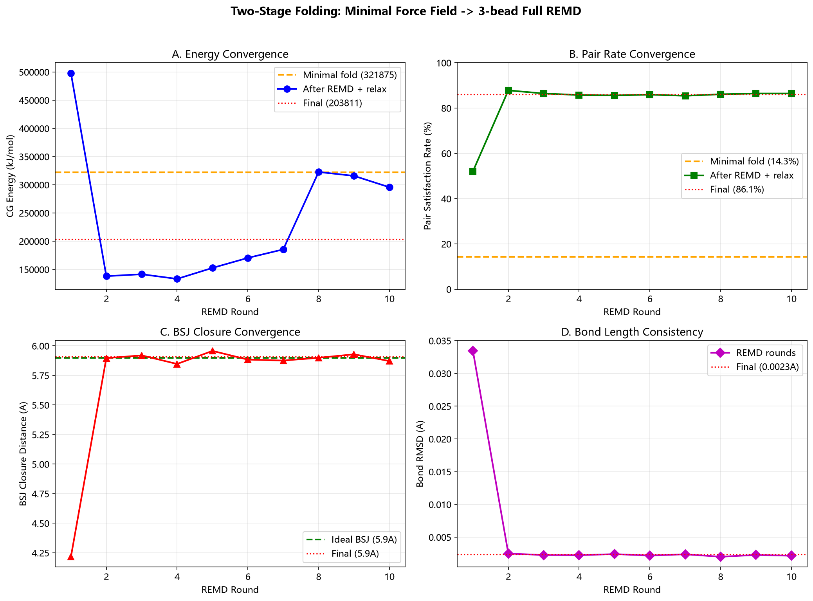
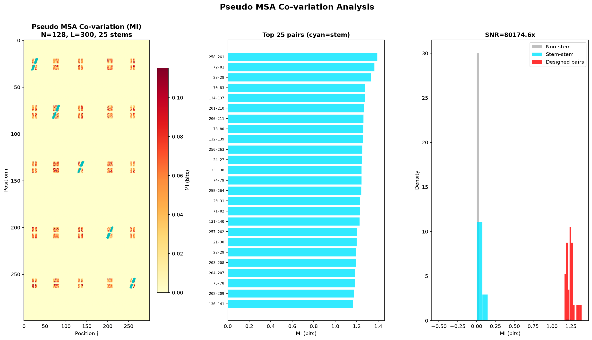
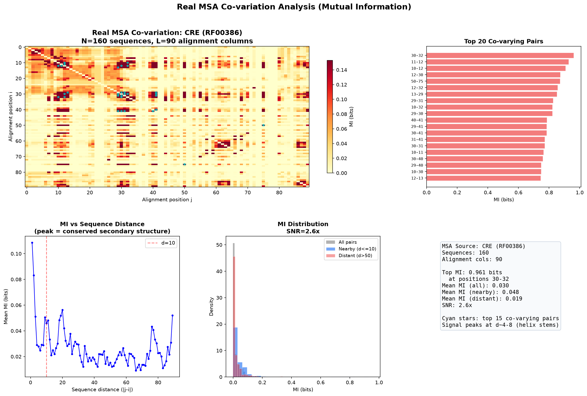

# TorusFold-circRNA

An end-to-end computational pipeline for **circular RNA 3D structure prediction** from sequence alone.

> Like AlphaFold for Circular RNA

## Overview

Circular RNAs (circRNAs) are covalently closed-loop RNA molecules with unique topological properties. Their 3D structures remain largely unknown -- only one experimental structure exists (PDB: 2OIU). This pipeline predicts circRNA tertiary structures through a multi-stage approach combining coarse-grained modeling, physics-based refinement, and reinforcement learning.

**Key results (after Level 4.9 PPR):**
- Produces physically validated structures in ~7 hours on a single CPU (2013-nt circRNA)
- Pair satisfaction: **100.0%** (657/657 pairs < 15 Å)
- BSJ closure: **5.898 Å** (ideal: 5.9 Å) | Bond RMSD: **0.0082 Å**
- rsRNASP: -37,890 | DFIRE: -231,878 | 3dRNAscore: 27.44 (>20 threshold)
- Validated against 2OIU crystal structure (167-nt C. elegans circRNA)

## Pipeline Architecture

```
Sequence
  |
  v
[1] Complementarity Scan + BFS Topological Distance
  |  ViennaRNA 2D structure + long-range pairing via back-splicing junction
  v
[2] RL-MCTS Pair Weight Optimization
  |  Reinforcement learning to optimize far-range pair weights
  v
[3] Coarse-Grained Folding (3-bead / 5-bead)
  |  CG force field + OpenMM refinement + REMD enhanced sampling
  v
[4] All-Atom Reconstruction
  |  A-form template + backbone rebuild
  v
[4.9] Post-hoc Pair Repair (PPR)
  |  Harmonic pair springs + backbone bonds + BSJ bond; vacuum minimization
  v
[5] Amber OL3 All-Atom Refinement (optional)
  |  Fine-grained molecular dynamics
  v
Validated 3D Structure
```

## Innovations

1. **Complementarity Scan + BFS Topological Distance** -- Exploits circular topology to identify long-range base pairs spanning the back-splicing junction
2. **Segmented 3D Folding** -- Segments RNA into structural elements (stems, loops) with separate refinement strategies
3. **Reinforcement Learning MCTS** -- Optimizes far-range pairing weights using policy gradient methods
4. **Multi-Source Secondary Structure Consensus (MUSES)** -- Combines ViennaRNA, NUPACK, and data-driven predictions
5. **Physical Refinement Pipeline** -- CG refinement -> all-atom reconstruction -> Amber OL3 fine-tuning
6. **Post-hoc Pair Repair (PPR, Level 4.9)** -- Iterative harmonic spring repair of unsatisfied base pairs with backbone bond constraints; raises pair satisfaction to 100% while preserving BSJ closure and backbone geometry (~10 min, CPU-only)

## Installation

```bash
# Create conda environment
conda create -n circrna python=3.10
conda activate circrna

# Install dependencies
pip install numpy scipy openmm matplotlib

# Install ViennaRNA (for secondary structure prediction)
conda install -c bioconda viennarna

# Install package
pip install -e .
```

## Quick Start

### Predict 3D structure from sequence

```python
from src.torusfold.scheme2 import predict_3d_allatom

sequence = "AUGCGCUAGCUAGCUAGCUAGC..."  # Your circRNA sequence
result = predict_3d_allatom(
    sequence,
    use_rl=True,           # Enable RL-MCTS optimization
    use_3bead=True,        # Use 3-bead CG model
    use_relaxation=True,   # Enable physical relaxation
)

print(f"BSJ distance: {result['uncertainty']:.3f}")
print(f"Structure saved to: output_3d.pdb")
```

### Run 2013-nt benchmark

```bash
python run_2013nt.py
```

### Run 2OIU benchmark

```bash
python scripts/benchmark_2oiu.py
```

## Project Structure

```
TorusFold-circRNA/
├── src/torusfold/scheme2/    # Core pipeline modules
│   ├── isrnaclong.py         # Main pipeline entry point
│   ├── pair_graph.py         # Complementarity scan + BFS topological distance
│   ├── segmented_vfold3d.py  # Segmented 3D prediction + Kabsch alignment
│   ├── multisource_ss.py     # MUSES multi-source SS consensus
│   ├── fivebead_folding.py   # 5-bead coarse-grained force field
│   ├── openmm_gpu_refiner.py # CG refinement + REMD enhanced sampling
│   ├── rl_optimizer.py       # RL-MCTS pair weight optimization
│   ├── metadynamics_sampler.py # Metadynamics enhanced sampling
│   ├── constraint_solver.py  # Geometric constraints
│   ├── aform_from_template.py # A-form template reconstruction
│   ├── allatom_reconstruct.py # CG -> all-atom coordinate reconstruction
│   ├── amber_refine.py       # Level 5 all-atom refinement (Amber OL3)
│   ├── multitask_heads.py    # structRFM-inspired prediction heads
│   ├── multitask_loss.py     # Multi-task loss functions
│   ├── p_to_5bead.py         # P-only to 5-bead coordinate conversion
│   └── __init__.py
├── scripts/                  # Analysis and benchmarking scripts
│   ├── benchmark_2oiu.py     # 2OIU crystal structure benchmark
│   ├── ppr_repair_v3.py      # Level 4.9 Post-hoc Pair Repair (PPR)
│   ├── plot_energy_convergence.py
│   ├── plot_pair_heatmap_v2.py
│   ├── plot_real_covariation.py
│   ├── plot_pseudo_msa.py
│   ├── diag_torsion_vs_pairs.py
│   └── diag_torsion_permtest.py
├── wiki/                     # Documentation
│   ├── 01_overview.md
│   ├── 02_pipeline_architecture.md
│   ├── 03_cg_forcefield.md
│   ├── 04_enhanced_sampling.md
│   └── 05_results.md
├── run_2013nt.py             # Main entry: 2013-nt circRNA prediction
├── README.md
├── LICENSE
└── .gitignore
```

## Benchmarks

### 2OIU (167-nt C. elegans circRNA)

The pipeline was validated against the only experimentally resolved circRNA structure (PDB: 2OIU). See `scripts/benchmark_2oiu.py` for the benchmark script.

### 2013-nt TNBC-targeting circRNA

Our target molecule for triple-negative breast cancer therapy. The full pipeline runs in ~7 hours on CPU.

## Methods

### Coarse-Grained Force Field

3-bead (phosphate-sugar-base) and 5-bead representations with custom force fields parameterized for circular RNA topology:

- **Bond terms**: Harmonic springs along backbone
- **Pairing terms**: Watson-Crick + non-canonical pairing potentials
- **Stacking terms**: Base stacking interactions
- **Long-range**: Statistical potential from PDB-derived contact maps
- **Closure constraint**: BSJ back-splicing junction loop constraint

### Enhanced Sampling

- **REMD**: Replica Exchange Molecular Dynamics (8 replicas, 300-460K)
- **Metadynamics**: Enhanced sampling along collective variables
- **RL-MCTS**: Monte Carlo Tree Search with policy gradient optimization

### Multi-Task Prediction

Inspired by structRFM, the pipeline uses multi-task heads for simultaneous prediction of:
- Base pairing probabilities
- Torsion angles
- Inter-residue distances

## Citation

```
@misc{yan2026torusfold,
  title={TorusFold: End-to-End 3D Structure Prediction for Circular RNA},
  author={颜子壹, 吉林大学计算机科学与技术学院},
  year={2026},
  howpublished={https://github.com/RomanCohort/TorusFold-circRNA}
}
```

## Web Frontend

Interactive web interface for structure prediction and visualization.

```bash
python serve.py 8877
# Open http://127.0.0.1:8877/web/index.html
```

Features:
- Sequence input with FASTA support
- Real-time pipeline progress tracking
- 3D structure viewer (Mol*)
- RNAdvisor scoring (rsRNASP, DFIRE, 3dRNAscore)
- Energy convergence visualization
- PDB download









## License

MIT License

## Acknowledgments

- Built upon the IsRNAcirc architecture
- ViennaRNA for secondary structure prediction
- OpenMM for molecular dynamics
- Amber force fields for all-atom refinement
- FBH Team, IGEM 2026
