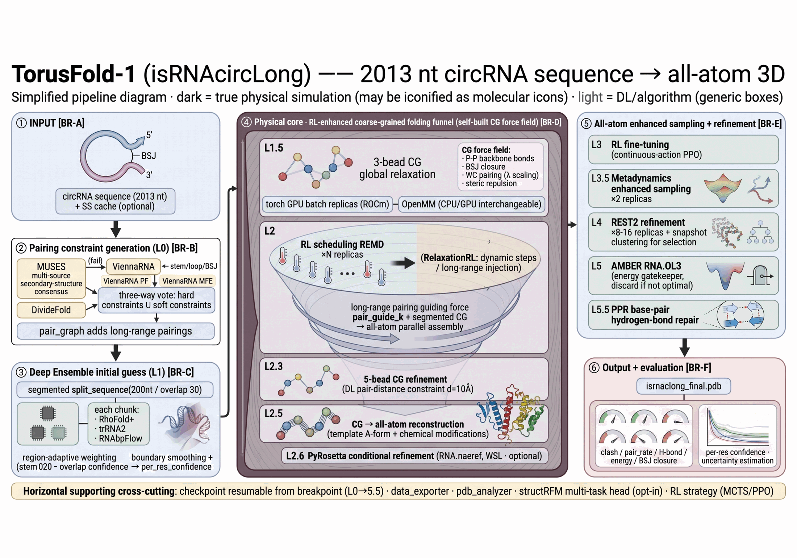
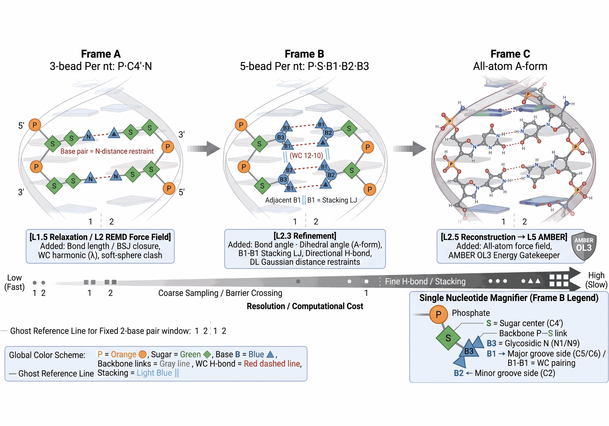

# TorusFold-Hybrid

_Team JLU-FBH · iGEM 2026 · Oncology Village — structure-prediction engine of the CirCure project_

> *"We choose to go to the Moon in this decade, not because it is easy, but
> because it is hard."* — J. F. Kennedy, 1962
>
> We chose to predict the 3D structure of long circular RNA for the same
> reason — because it is hard. To our knowledge, no one has yet produced an
> end-to-end all-atom fold of a circRNA beyond ~2,000 nt. At iGEM meetups, few
> teams reach for circRNA as a drug vehicle — not because circRNA is a poor
> idea, but because, without a structure-prediction tool, the design feels out
> of control. circRNA drug design (immunogenicity control, dsRNA/ssRNA exposure
> ratio, IRES translation efficiency) is evaluated through 3D coordinates:
> IRES-element accessibility and solvent-accessible surface area (SASA) do not
> exist without a structure. TorusFold exists so a future team can choose
> circRNA confidently — without wondering whether the job is even doable.

**The gap.** The 1980s–90s ribozyme era put RNA at the centre of biology, but
RNA 3D structure determination then fell two decades behind proteins:
RNA-only PDB entries remain a tiny fraction, and for circular RNA exactly
**one** complete structure exists (PDB: 2OIU). Template-based prediction
inherited the drought — 3dRNA yields locally irrational models on circular
constructs (PLoS Comput. Biol. 2024, doi:10.1371/journal.pcbi.1012293) —
while physics-based *de novo* folding stayed out of reach for 1000+ nt
circular RNA. That is the gap TorusFold fills.

Physics-based **circRNA 3D structure prediction**. A multi-predictor ensemble
(RhoFold+ · trRosettaRNA2 · RNAbpFlow) feeds a coarse-grained folding engine
that is relaxed with OpenMM molecular dynamics, replica-exchange and
metadynamics, then reconstructed to all atoms and refined under the Amber14-OL3
force field — producing experimentally plausible models for long (1000+ nt)
circular RNA. (An RL-based sampling scheduler exists as a preview feature —
see Implementation notes below.)

> This repository is the official software deliverable of Team JLU-FBH
> (iGEM 2026, Oncology Village). It is the structure-prediction engine of
> CirCure, our multi-epitope circRNA vaccine platform for triple-negative
> breast cancer — see the wiki Software page for how predicted 3D models
> feed the CirCure design loop. All source code lives on `main`; a
> release is created automatically at Wiki Freeze as the judging artifact.
> If you use an AI assistant here, please read
> [.claude/RESPONSIBLE_AI_USE.md](.claude/RESPONSIBLE_AI_USE.md) first.

## Visual overview

<p align="center">
  
  <br/>
  <em>TorusFold end-to-end pipeline: circRNA sequence → multi-source secondary-structure consensus → base-pair constraints → segmented 3D ensemble prediction (RhoFold+ · trRosettaRNA2 · RNAbpFlow) → RL-guided coarse-grained folding & sampling → all-atom reconstruction → Amber14-OL3 refinement.</em>
</p>

<p align="center">
  
  <br/>
  <em>Multi-resolution coarse-grained representation. The physics core folds each window at increasing resolution (3-bead → 5-bead → all-atom), activating more detailed interaction terms at each level.</em>
</p>

## Description

circRNA back-splicing creates covalently closed circular RNA molecules whose
three-dimensional folds are almost entirely uncharacterized — only one circRNA
has an experimentally resolved structure to date (PDB: 2OIU). We predict full
all-atom 3D models for long circRNA sequences (e.g. the 2013 nt TNBC-targeting
construct in `run_2013nt.py`) without requiring any experimental restraints.

**How it works**

```
sequence
  └─ Level 0   MUSES multi-source secondary-structure consensus
               (multisource_ss / ViennaRNA fallback)
               PF base-pair-probability fusion
               + NCM non-canonical pair detection
  └─ Level 1   segmented 3D prediction, ≤200 nt per chunk
               ensemble_predict: RhoFold+ · trRosettaRNA2 · RNAbpFlow
               region-adaptive weights (stem / BSJ / loop),
               Kabsch stitching, NCM distance back-inference
  └─ Level 2   RL-guided coarse-grained close (RL MCTS + steering forces)
               iterative relaxation, REST2 × T-REMD replica exchange,
               well-tempered metadynamics,
               PyRosetta conditional refinement
  └─ Level 5.5 PPR base-pair hydrogen-bond repair
  └─ all-atom  1EHZ-crystal-template reconstruction (aform_from_template)
               Amber14-OL3 constrained minimization (amber_refine)
  └─ output    PDB + per-residue confidence + immune/structure fingerprints
```

The main entry point is `isrnaclong_pipeline()` in
[`src/torusfold/scheme2/isrnaclong.py`](src/torusfold/scheme2/isrnaclong.py);
segmented prediction is in `segmented_vfold3d.py`; the physics/refinement core
in `openmm_gpu_refiner.py`, `rest2_remd_2d.py`, `metadynamics_sampler.py`,
`torch_cgsim.py` and `torch_gpu_refine.py`.

**Features**

- Three-predictor ensemble with region-adaptive weights
- NCM (non-canonical pairing) detection as fourth evidence source
- RL MCTS guiding long-range (far) pair closure
- REST2 × T-REMD and well-tempered metadynamics enhanced sampling
- 1EHZ-crystal-template all-atom reconstruction + Amber14-OL3 refinement
- Atomic checkpoint resume, per-level success guards
- Web UI with SSE log streaming and Mol* 3D viewer
- Per-residue confidence + immune/structure fingerprints

## Installation

```bash
git clone <this-repo>
cd torusfold-hybrid
pip install -e .

# Secondary-structure folding needs ViennaRNA (provides the `RNA` module):
conda install -c conda-forge viennarna      # or: pip install ".[ss]"
```

Optional extras: `[gpu]` (PyTorch CG path), `[ml]` (multi-task heads /
circRNA library), `[plot]` (analysis scripts), `[pyrosetta]` (full-atom
refinement; Linux/WSL).

> **Scope note.** This repository ships the physics/refinement core plus the
> web frontend. The sequence/structure predictors it consults — RhoFold+,
> trRosettaRNA2, RNAbpFlow and the DivideFold SS subprocess — are *external*
> tools. Point to the first three via the environment variables below;
> DivideFold is resolved from a `DivideFold-main/` checkout next to this
> repository (see the AI/model disclosure table). Two legacy aggregator modules
> referenced by `predict_3d_allatom` (`cg_forcefield`, `modification_aware`)
> are not yet published and are under active development.
>
> Full install/deploy instructions for every external tool (ViennaRNA, OpenMM,
> the three predictors, isRNAcirc, TriRNASP, PyRosetta, structRFM, Rfam):
> see [docs/DEPLOY_EXTERNAL.md](docs/DEPLOY_EXTERNAL.md).

## Usage

**End-to-end demo — 2013 nt circRNA.** Put the target sequence (plain text,
`T`→`U` handled) in `sequence.txt`, then:

```bash
python run_2013nt.py
# → output_2013nt/isrnaclong_final.pdb
```

Run flags (RL close, REST2 replicas, REMD rounds, PyRosetta, PPR repair,
pseudo-MSA fallback) are configured as call arguments in `run_2013nt.py`.

**Shorter runs, and the provenance of the ≈7 h figure.** The pre-built viewer
structure was produced by an **earlier internal build** of the pipeline (OpenMM
CPU path) that is no longer in this repository, so its ≈7 h wall time is a
historical measurement, not a figure reproducible from this checkout. The
checked-in `run_2013nt.py` carries a higher configuration (`n_rest2_replicas=16`,
`rest2_nsteps=100000`, `nrep=16`, `n_relax_rounds=20`). To run shorter, pass
smaller values explicitly — e.g. `n_rest2_replicas=8`, `rest2_nsteps=20000`,
`nrep=2`, `n_relax_rounds=8` — and budget the wall time from a fresh measurement.
Per-stage step counts for the current code are tabulated in
`docs/REPRODUCTION_RESOURCES.md` §2.1.

**Web server.**

```bash
python serve.py            # default port 8877
# open http://127.0.0.1:8877  (SSE log stream + Predict API + Mol* 3D viewer)
```

Pre-built interactive demo of the 2013 nt prediction:
`docs/circrna_3d_viewer.html`.

**External predictors & runtime paths** are configured through environment
variables (no hard-coded machine paths in this repository):

| Variable | Purpose |
|---|---|
| `RNABPFLOW_ROOT` | RNAbpFlow checkout dir (`checkpoint/RNA3DB.ckpt`, `inference_rocm.py`) |
| `RNABPFLOW_PYTHON` | Python used to launch RNAbpFlow (default: current interpreter) |
| `TRRNA2_RUNNER` | path to the trRosettaRNA2 runner script |
| `RHOFOLD_ROOT` | RhoFold+ checkout dir (`pretrained/rhofold_pretrained_params.pt`) |
| `ISRNACIRC_BIN_DIR` | dir containing `CG_to_allatom.exe` + DLLs (Windows, ASCII path) |
| `CG_TO_ALLATOM_COEFF` | isRNAcirc CG→all-atom coefficient dir |
| `TF_STRUCTRFM_MODEL` | pretrained structRFM checkpoint for the multi-task heads |
| `TF_SCHEME2_SRC` | optional extra source dir injected into the server `sys.path` |
| `PPR_INPUT_PDB` / `PPR_OUT_PDB` | input / output PDB for the PPR repair script |
| `RFAM_CM` | `Rfam.cm` path for cmsearch-based MSA (optional) |
| `TF_DIVIDEFOLD_ROOT` | DivideFold checkout dir (default: `DivideFold-main/` next to this repo) |
| `TF_DIVIDEFOLD_PYTHON` | Python used to launch the DivideFold SS subprocess (default: current interpreter) |
| `TF_DIVIDEFOLD_RUNNER` | path to the DivideFold SS runner script (default: `scripts/_dd_runner.py`) |

**Repository layout**

```
├── run_2013nt.py          end-to-end 2013 nt demo
├── serve.py               SSE + Predict API + web viewer
├── src/torusfold/
│   ├── scheme2/           pipeline core (47 modules): folding, RL, REMD/MetaD,
│   │                      NCM detection, ensemble predictor wrappers, Amber refine
│   ├── circrna_library/   CIF/PDB ingest + circular QC (gemmi)
│   └── web/               browser frontend (Mol*, live logs, prediction panel)
├── scripts/               curated analysis & diagnostics
└── docs/                  architecture, viewer, library notes
```

## Data and large files

This repository holds **source code only**. Model weights, datasets and heavy
predictor checkouts are *not* committed:

- RNAbpFlow (~1.3 GB checkpoints) and the TriRNASP statistical potential are
  third-party tools installed separately.
- Prediction outputs (`output_*`), model weights and caches are git-ignored.
- Datasets and trained models used for the iGEM season will be archived on
  Zenodo and linked here (DOI added at Wiki Freeze).

**Planned asset — a circRNA design-element library.** Beyond raw structures,
we plan to publish a curated, schema-documented element library that dissects
predicted structures into reusable design elements — back-splice junction
geometries, IRES-containing domains, exposure/immunogenicity-relevant motifs —
each with its 3D context. The goal is that teams designing circRNA payloads
can look up "how does this element fold" the way they look up a sequence
motif today. First entries ship with the Wiki Freeze release / Zenodo
archive; the underlying data layer (`circrna_library/`) already enforces
provenance separation between experimental structures, experimental
constraints, and physics-generated hypotheses.

## Contributing

Issues and merge requests are welcome. This is an active research codebase;
please keep changes focused and add tests under the project conventions when
possible. Every contributor remains responsible for the accuracy of their
commits — see [.claude/RESPONSIBLE_AI_USE.md](.claude/RESPONSIBLE_AI_USE.md).

## Authors and acknowledgment

Team JLU-FBH (iGEM 2026). Primary developer: Ziyi Yan. Built in the Dry Lab at
Jilin University.

## For judges & non-experts (quick tour)

You do **not** need to run the full pipeline to evaluate this tool:

1. **See a real predicted structure in seconds** — open
   [`docs/circrna_3d_viewer.html`](docs/circrna_3d_viewer.html) in any browser:
   it loads the pre-built 2013 nt prediction with no install (hover, rotate,
   recolor).
2. **Try the web UI** — `python serve.py` serves the Mol* viewer with live
   logs and a Predict API at `http://127.0.0.1:8877`.
3. **Reproduce the headline result** — install (below), put the 2013 nt
   sequence in `sequence.txt`, run `python run_2013nt.py`, and inspect
   `output_2013nt/isrnaclong_final.pdb`.

Running the full ensemble needs external predictors and (ideally) a GPU — see
[docs/DEPLOY_EXTERNAL.md](docs/DEPLOY_EXTERNAL.md).

Hardware requirements, measured runtime profiles (≈7 h CPU for the 2,013 nt
demo, dominated by the Level-2 REMD sampling; GPU-mode notes) and a
three-level access guide — view-only / download / reproduce — are in
[docs/REPRODUCTION_RESOURCES.md](docs/REPRODUCTION_RESOURCES.md).

## AI / model disclosure

This software **calls machine-learning RNA structure predictors as external
tools**; it does **not** train them, and it ships no trained weights:

| Model | Source | Used for | Weight/data provenance |
|---|---|---|---|
| RhoFold+ | Wang et al., *Nat. Methods* 2024 | per-chunk 3D prediction (`rhofold_wrapper`) | external checkpoint |
| trRosettaRNA2 | Li et al., *Nat. Commun.* 2021;12:5934 | per-chunk 3D prediction (`trrna2_wrapper`) | external checkpoint |
| RNAbpFlow | Bhattacharya-Lab/RNAbpFlow | 3D flow prediction / distance evidence (`ensemble_predictor`) | `RNA3DB.ckpt` (trained on RNA3DB/bpRNA), archived separately |
| structRFM | inspired by Zhai et al., *Nat. Commun.* 2024 | optional multi-task heads (`multitask_heads`) | external checkpoint |
| DivideFold | external RNA folding predictor — Omnes L, Angel E, Tahi F. *DivideFold+: an AI-based tool for RNA secondary structure prediction...* J Mol Biol. 2026;438(18):169865 (doi:10.1016/j.jmb.2026.169865); team checkout named `DivideFold-main` | SS evidence for the Level 0 consensus (`ss_divide`, CPU subprocess) | external checkout (`DivideFold-main`; `TF_DIVIDEFOLD_ROOT`) |

The folding/refinement core of this repository is **physics-based
(zero-training)**: CG MD, REST2×T-REMD, metadynamics and Amber14-OL3 — no
learned model. No fine-tuning data is committed. Development used an AI coding
assistant; see [.claude/RESPONSIBLE_AI_USE.md](.claude/RESPONSIBLE_AI_USE.md)
for the team's responsibility policy.

**Evaluation & limitations.** No experimental (wet-lab) validation has been
performed yet for the demo construct. A 2OIU force-field integrity test
(X-ray structure → Level-2 relaxation, 17 min CPU, final RMSD 1.83 Å) is
completed and shows the force field does not distort known structures;
independent validation is otherwise pending (2OIU from-sequence recovery and
replica-exchange acceptance checks — dated status in
[docs/NOTES.md](docs/NOTES.md), which also records known dead ends; please
read it before extending the code).


## Implementation notes (why it works)

Short answers to the questions a computational reviewer usually asks. Each
entry points to the module that implements it.

1. **Batched replica exchange on one tensor.** In `torch_cgsim.py`
   (`BatchedREMD` / `BatchedREMD2D`), all replicas live in a single
   `(B, N, 3)` tensor and a Metropolis swap is a **tensor-index permutation**
   — no coordinate copies, no process pipes. The classical CPU alternative is
   one OpenMM process per replica (~200 ms/step) with pipe-based swaps.
   Energy and forces are computed by the same explicit-force function, so the
   swap criterion and the dynamics are consistent by construction.
2. **Asynchronous CPU-side force injection.** Statistical-potential forces
   (TriRNASP, optional preview feature) are evaluated on a CPU process pool
   (`_refresh_cpu_forces_async`) and injected into the GPU force cache;
   when replicas are exchanged the force cache is permuted together with the
   coordinates (`_swap_tri_force_cache`), so replica identity stays
   consistent across the swap.
3. **No-autograd explicit forces.** Forces follow the TorchMD recipe:
   analytic, autograd-free force evaluation with a cell-list neighbor table
   (O(N) memory instead of O(N²)). Because each force function returns energy
   and forces together, the two can never drift apart, and `_require_finite`
   guards every stage. An autograd implementation is kept alongside
   (`cg_forces_autograd`) for cross-checking.
4. **Analytic CV gradients for metadynamics.** The GPU metadynamics sampler
   (`metadynamics_gpu.py`) computes CVs (e.g. radius of gyration) with
   hand-written analytic gradients and deposits well-tempered hills as batched
   tensor updates — no autograd on the sampling loop.
5. **RL-based sampling scheduling — preview feature.** A reinforcement-
   learning controller can suggest sampling budgets and pair weights
   (nstep / pair_weights). It starts from a heuristic policy (ViennaRNA run at
   scale on long circBase sequences as a weak-but-available prior) and is
   refined by online learning; it is deliberately conservative and never
   overrides the physics. Like the TriRNASP statistical potential, it is a
   documented preview idea rather than a headline claim — see NOTES.md.
7. **Length scaling of the sampling budget.** For very long chains the total
   budget is halved at L > 500 and halved again at L > 1,000
   (`isrnaclong.py`, length scaling). Rationale: sampling bottlenecks are
   local — segments are fixed at 200 nt and each segment relaxes
   independently of total length, while long-range pairing is handled by
   constraints plus the temperature ladder — so the total need grows slower
   than linearly. This is a working heuristic: it is guarded by early
   stopping and energy gates, and a formal scaling benchmark is on the
   roadmap.
8. **Chunk fusion is confidence-weighted, with bidirectional context.**
   Segment predictions (200 nt, 30 nt overlap, raised to ease boundary
   effects) are fused by confidence-weighted assembly (Kabsch alignment,
   `segmented_vfold3d.py`), then refined with bidirectional context
   (NLP-style: each boundary is corrected by neighbors on both sides, ±50 nt
   with linear decay, `_refine_with_context`) before the final global
   relaxation.
9. **NCM candidates are filtered by a thermodynamic cost.** Non-canonical
   pair candidates survive only if their local folding cost is affordable:
   `ncm_thermo_filter.py` refolds the local window with and without the
   candidate and suppresses it when ΔΔG > 2.0 kcal/mol, down-weights to 0.5
   between 1.0 and 2.0 kcal/mol. The thresholds are empirical, but the
   quantity being thresholded is a physical free-energy cost.

## Force-field constants: what each one is set by

Every constant in `src/torusfold/scheme2/torch_cgsim.py` is set by one of four things, and the
four are not equally strong. This is the index; the reasoning, the numbers and the failed attempts
are in `docs/statistical_potentials_as_forces.md` and in the comment at each constant.

| constant | value | set by | where the number comes from |
| :-- | --: | :-- | :-- |
| `BOND_P_NEXT` | 0.590 | **measured** | mean over 6638 phosphodiester P(i)-P(i+1) bonds |
| `K_BB` | 1122.4 | **criterion** | `kBT/sigma^2`, sigma = 0.0470 nm over those 6638 bonds |
| `K_INTRA_PC` | 20752.7 | **criterion** | `kBT/sigma^2`, sigma = 0.010963 nm |
| `K_INTRA_CN` | 36399.2 | **criterion** | `kBT/sigma^2`, sigma = 0.008278 nm |
| `K_INTRA_PN` | 1785.9 | **criterion** | `kBT/sd^2`, sd = 0.0374 nm over 6764 observations |
| `K_LINK_CP` | 9574.4 | **criterion** | `kBT/sd^2`, sd = 0.0161 nm |
| `K_LINK_NP` | 5477.7 | **criterion** | `kBT/sd^2`, sd = 0.0213 nm |
| `K_LINK_NC` | 383.0 | **criterion** | `kBT/sd^2`, sd = 0.0807 nm |
| `K_ANGLE` | 28.1 | **criterion** | `kBT/sigma^2`, sigma = 0.297764 |
| `K_DIH` | 7.2 | **criterion** | `kBT/sigma^2`, sigma = 0.587994 |
| `CLASH_SIGMA` | 0.3975 | **measured** | the database's minimum non-bonded P-P distance |
| `K_CLASH` | 20000.0 | **criterion, thin** | Boltzmann inversion of two bins containing ONE pair |
| `K_BPP` | 13.4 | **criterion** | `0.6 * kBT / sigma_NN` |
| `K_PAIR_GUIDE` | 20.8 | **criterion** | must not move the pair minimum by more than one spread |
| `K_BSJ` | 1122.4 | **transferability** | the BSJ *is* a phosphodiester bond; not measured |
| `K_BSJ_GUIDE` | 11.6 | **criterion** | same, on the closure coordinate, one *bond* spread |
| `GB_FORCE_CAP` | 50.0 | **guard** | caps the solvation gradient only |
| `force_cap` | 5000.0 | **guard** | above the 4103.6 max force at native geometry |
| `K_STACK` | 0.0 | **ablation** | exactly redundant with `K_BB` and `K_ANGLE` |
| `K_PAIR` | 600.0 | **no measurement** | bracket [204.8, 2173.9]; see below |
| `K_BSJ_CONTACT` | 50.0 | **no criterion** | 17.3 percent of the energy at native geometry |

The distinction that matters: **criterion** means `k = kBT/sigma^2` over the deposited-structure
database, applied uniformly. **Transferability** means the value was inherited from a different
coordinate by chemical identity. **No measurement** means exactly that.

### Known limits, stated so they are not rediscovered as surprises

- **`K_PAIR` has a measured floor and a measured ceiling and nothing inside.** The floor is
  `kBT/sigma_NN^2 = 204.8`; the ceiling is 2173.9, where a register-shift decoy starts preferring
  the wrong pairing. Nothing measured separates 600 from 1500, and the reason is now known: the
  database has **no thermal width** for this coordinate. 98.6 percent of its spread is
  residue-to-residue inside one conformation, so the pooled sigma is not a thermal width and no
  amount of statistics will make it one.
- **`K_BSJ` and the two related terms are the only ones set without a measurement**, because no
  deposited chain is covalently closed.
- **Three terms are 91.55 percent of the energy on a linear reference** (`bsj closure` 68.17,
  `bsj contact` 23.46). They act on `P(0)-P(L-1)`, which only exists in a circular molecule. A run
  on a linear chain should set all three to zero and say so in its provenance line.
- **The residual depends on the sampling window, and the converged window is much better.**
  `ibi_round0.py` used to throw away only the first 3.2 ps of a 16 ps run (`burn = NSTEPS // 5`),
  which reports a transient: joint 0.3263 on the corrected field, 0.2937 before it. With the burn
  set separately and a 40-200 ps window, the same field gives **0.0968**, and three of the six
  coordinates land on the reference almost exactly (intra_cn **1.000**, stack 0.992, intra_pc
  1.010). Read `--blocks=N` and judge by the block spread: a cumulative number cannot tell
  a settled window from a lucky early one, which is how the 40-200 ps run read 0.0911 before
  climbing to 0.0968. Section 3ba.
- **The coupling does not push every coordinate the same way.** On the converged window bb_bond
  is 12 percent wide, while angle and dihedral are 10 and 29 percent NARROW. The field is not
  simply too soft. The dihedral is over-constrained and owns 59 percent of the joint residual,
  and that is the thing IBI iterates on -- its one-dimensional prediction is correct by
  construction, so no other k will fix it.
- **200 ps is not yet a stationary distribution.** The block spread and a dihedral that is still
  narrowing between 40 and 200 ps both say so. Until the blocks agree, any residual is a mixture
  and is not a valid input to an IBI update.
- **The minimiser in `check_field_after_fix.py` currently stalls.** Six restarts, max abs F
  690.19 kJ/mol/nm against a 236.3 force floor, so that script's starting point is not a true
  minimum. This is the one open item in the acceptance table below.
- **The excluded volume has one range for all bead types.** It presses outward on 167 of 2 022 024
  pairs. Per-type ranges were measured and rejected: they would remove 0.008 percent of contacts
  and the criterion cannot supply a per-type stiffness.
- **`cg_energy_forces` is the production field.** Four other entry points in the same module
  compute different potentials under the same constant names; they raise unless
  `ALLOW_ALTERNATE_FIELDS` is set.

### Reproducing any of it

Every number above comes from a script, and each script prints what it measured:

```
python scripts/decompose_pair_spread.py              # the base-pair spread, and why it has no thermal part
python scripts/determine_k_bb.py                     # the K_BB sweep and the cap-saturation check
python scripts/measure_pair_equilibrium.py           # where the pair minimum actually sits
python scripts/solve_pair_guide_scale.py             # K_PAIR_GUIDE from the one-spread criterion
python scripts/measure_bsj_equilibrium.py            # the closure coordinate, same question
python scripts/measure_bsj_on_linear_references.py   # the 91.55 percent
python scripts/ibi_round0.py 8 8000                  # the residual IBI would correct
python scripts/audit_field_state.py                  # every live constant, and which paths are live
python scripts/scan_unreturned_energies.py           # terms computed and never read
```

`python -m pytest tests/` is 135 tests. Several of them exist to stop a constant moving away from
the measurement above without the suite saying so.

The sixteen silent defects that were found and repaired in this field - a number this file and
`docs/attribution.md` both used to state as nine, without a list - are indexed in
`docs/silent_defects.md`, one row each, with the measurement that found it and the test that
now holds it. The index exists so the count can be checked.

### If you change a constant

The numbers in sections 3ax and 3ay of `docs/statistical_potentials_as_forces.md` are the
acceptance test for any edit to `torch_cgsim.py`, not only for the constants those sections
changed. Run these four and compare against the table below.

```
python scripts/audit_field_state.py                  # every live constant, and which entry points are live
python -m pytest tests/ -q                           # 135 tests; several pin the constants to their measurements
python scripts/ibi_round0.py 8 8000                  # the sim/ref residual, 8 replicas x 16 ps
python scripts/check_field_after_fix.py 40.0 2 6000  # 40 ps of dynamics, then minimisation
```

| what it checks | what it measures now | how it fails |
| :-- | --: | :-- |
| last-quarter T | 289.4 K (mean 295.9, 0.99x) | far from 300 K: the thermostat or a cap broke |
| potential-energy drift | -171.2 kJ/mol over 40 ps | measured from an unconverged start; see below |
| minimiser | 4427 iterations, 6 restarts, max abs F 690.19 | **this row currently fails** |
| frames below 0.30 nm | 0 / 3000 | this is the collapse check |
| joint mean abs ln(sim/ref) | 0.3263 (a transient; see below) | see the paragraph below |

**The minimiser row is the one open item, and it is why the drift row is not yet meaningful.**
`check_field_after_fix.py` descends with a halving step (accept `x + s*f` and grow it by 1.2, else
halve, restart below 1e-12), so six restarts say the method stalls on this landscape, not that a
690 kJ/mol/nm force is unbalanced. It is nonetheless above the P-C4' force floor of 236.3, so that
run's starting point is not a true minimum and its -171.2 drift is the relaxation of that start
rather than a property of the field.

Section 3ay has the full comparison and the identified cause: putting `_sigmoid_f` into its
correct long-range shape changed its curvature at the well from -130 to +130 kJ/mol/nm^2, which
raises the effective WC pair spring from about 470 to about 730 at `K_PAIR_GUIDE = 20.8`.
Rebalancing that means touching `K_PAIR`, whose criterion only bounds it to
[204.8, 2173.9] with no measurement inside.

**Expect the joint metric not to move, and do not treat that as failure.** One `k` buys one
coordinate and sells another: raising `K_BB` sharpened bb_bond to exactly the reference
sigma (1.588 down from 1.945) and pushed intra_pc, intra_cn and angle from 1.36 / 1.36 / 1.09 to
1.50 / 1.49 / 1.19, leaving the joint residual at 0.2937 against 0.2895. The `_sigmoid_f` correction
then moved it to 0.3263, eleven percent the other way. Both are measurements, not tolerances, and
both are transients on this window, so neither is this field's fit quality. A
change that improves the joint number by less than about 10 percent has not been shown to do
anything, and matching the joint distribution needs IBI iterating on the potential rather than
another constant.

## Update log

Newest first. Every entry is a measurement from a script in `scripts/`, not a plan.

### Dev-machine round (findings reported back, not run here)

`ibi_round0.py`'s default window is `burn = NSTEPS // 5`, which throws away only the first
3.2 ps of a 16 ps run. On the same field, the same seed, changing only the window:

| window | bb_bond | intra_pc | intra_cn | angle | dihedral | stack | joint |
| :-- | --: | --: | --: | --: | --: | --: | --: |
| 3.2-16 ps (the default) | 1.588 | 1.499 | 1.494 | 1.191 | 0.983 | 1.352 | **0.2937** |
| 16-80 ps | 1.185 | 1.067 | 1.062 | 1.134 | 0.829 | 1.209 | **0.1330** |

**So every IBI round-0 residual in this file, in section 3ax and in section 3ay is a transient.**
0.2937 is not this field's equilibrium residual, and the 0.2937 against 0.3263 comparison in 3ay
compares two transients on the same window. The 11 percent is real for that window and is not a
statement about the field. Section 3az carries it, and section 3ay now says so on the table.

**The `K_PAIR` sweep tested a different question than intended.** Lowering it from 600 to 470 moved the
joint residual the wrong way (-2.51 percent); the best point of the four was 340 at +3.31 percent,
under the 10 percent bar, so `K_PAIR` stays 600. But that sweep ran on the pre-fix field, where the
guide's curvature at the well is `-k/(4w^2)`, so lowering `K_PAIR` pushes the effective spring further
down rather than back. The 3ay reading is still untested.

**`audit_field_state.py` crashed at its five-path comparison and now does not.** It called the four
entry points that `_alternate_field` guards; comparing them is the script's whole purpose, so it now
forces `ALLOW_ALTERNATE_FIELDS` and says in its output that it is crossing that line. It also shows
that section 3at's five-path table predates the four-constant change: the same 1L2X now gives
3669.9917 for `cg_energy_forces`, -0.0280x for the two explicit paths and 0.3271x for `cg_energy_3bead`.

**Rate: 60.2-62.1 steps/s there against 22.3-23.1 here, so 16 ps is 130 s and not 5.8 min.**
Everything scheduled off the local rate is 2.7 times more expensive than it needs to be.

**Also: a folder copy is not a revision.** The report came from a tree with no `.git` whose contents
equal `424e1d7` -- 131 tests in the README, the analysis document ending at 3ax, the old guide shape
still in the source. Check which revision a tree is before believing a baseline against it; the
one-line check is in `docs/dev_machine_handoff.md`.

### Force-field audit round (`441cdd8`, `6e7a44b`)

**The two guide terms were pointing the wrong way, and the cost of fixing it is measured.**
`_sigmoid_f` computed `E = -k*softplus((r0-r)/w)`: it pulled hardest when a pair was already
too close and vanished at long range. That is the opposite of the "far/long-range pair guiding
force" its name and its constant block claim, and the opposite of what its own docstring
described. It is now `E = +k*softplus((r-r0)/w)` at all five sites. The two shapes give the
**same force at `r0`** -- `k/(2w)` inward -- and **opposite curvature** there, `-k/(4w^2)` against
`+k/(4w^2)`, so at `K_PAIR_GUIDE = 20.8` and `w = 0.2` the effective WC pair spring moves from
`600 - 130` to `600 + 130`. The shape comparison itself, at 0.5 to 3 nm and at the
pair minimum, is `scripts/measure_guide_shape_fix.py`. The same two commands as the 3ax verification:

| | before | after |
| :-- | --: | --: |
| last-quarter T | 302.7 K | 289.4 K (mean 295.9, 0.99x) |
| potential-energy drift | -3.2 | -171.2 kJ/mol over 40 ps |
| minimiser | 6000 iters, 0 restarts, max abs F 69.80 | 4427 iters, 6 restarts, max abs F 690.19 |
| frames below 0.30 nm | 12 / 3000 | **0 / 3000** |
| joint mean abs ln(sim/ref) | 0.2937 | 0.3263 (both transients) |

The minimiser row is the open item, and it is why the drift row is not yet meaningful: the script
descends with a halving step, so six restarts say the method stalls on this landscape, not that a
690 force is unbalanced. Section 3ay has the full comparison and the curvature arithmetic.

**The defect count now has a list behind it.** `docs/silent_defects.md` indexes **sixteen** silent
defects, one row each, with the measurement that found it and the test that now holds it. This file
and `docs/attribution.md` both used to say "nine" with no list behind it. Fifteen of the
sixteen were producing a wrong number; the sixteenth is four independent copies of the
excluded-volume law, which agreed at the time and would have gone stale on the next edit.

**`GB_FORCE_CAP` is a guard, measured rather than assumed.** `scripts/check_gb_cap_heating.py` runs
the same 20 ps at cap 50, 500 and 1e9 and gets the same mean kinetic temperature (311.5 K) and the
same closest-approach median (0.3147 nm) in all three, so the inner clip is not a heat source. The
reference thermal speed that script prints was also 10x low and is fixed.

**The stored tables' interpolation gap, in under a second.** `scripts/table_convention_gap.py` and
`tests/test_table_convention_gap.py`. `boltzmann_bonded._sample` reads `U_i = -kBT ln p_i` as the
potential at the bin centre when those numbers are bin masses; the gap that matters is the one in
`results/boltzmann_tables_clean.npz`, because that is the table the IBI path loads. At the core
maximum: angle 1.045, dihedral 1.800, stack 0.366 kBT. Those are larger than the 0.36 / 0.49 / 0.29
recorded earlier, and the difference is not a bug -- that reading came from a freshly fitted table.
The closed-form bin-mass integral is checked against a fine-grid integration of the same
interpolant, so the pinned numbers are not pinning a bug.

**Also in this round.** The straight Wiki Description version is in `docs/description.md`, carrying
the real defect count and the three limits. `docs/attribution.md`'s Specific Tasks word count
was six words off; it is 139, counted on the body. `### If you change a constant` above is new. And
`docs/dev_machine_handoff.md` carries the ordered task list for the dev machine, including the
per-coordinate baseline to reproduce before anything else is believed.

## Data formats & synthetic-biology standards

Input: FASTA-like plain sequence (`sequence.txt`, `T`→`U` handled);
secondary-structure strings (dot-bracket). Output: PDB (all-atom) + JSON
metrics. This is a **structure-prediction** tool, so it does not emit SBOL /
genetic-design constructs; where a circRNA is later cloned for wet-lab work the
PDB is the geometry reference and the sequence can be re-exported to FASTA /
GenBank as needed.

## Testing & CI

- `tests/test_smoke.py` — compiles every Python file and imports the
  `torusfold.scheme2` package (needs only numpy).
- `.gitlab-ci.yml` — runs the smoke suite on every push to keep `main` green.
- Run locally: `pip install -e . && python -m pytest -q tests`.

## License

[Apache-2.0](LICENSE). External components retain their own licenses
(RNAbpFlow, TriRNASP, ViennaRNA, Mol*, RhoFold+, trRosettaRNA2, OpenMM).
